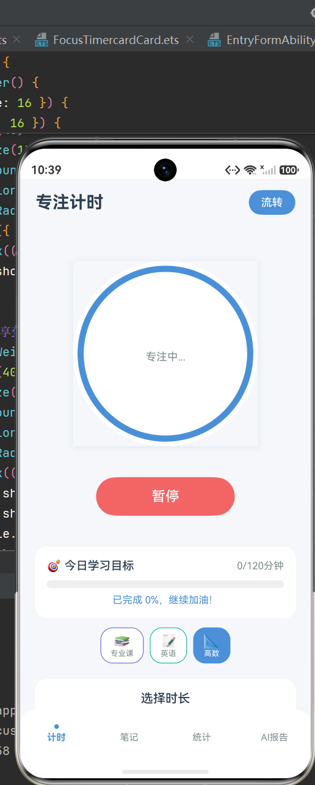
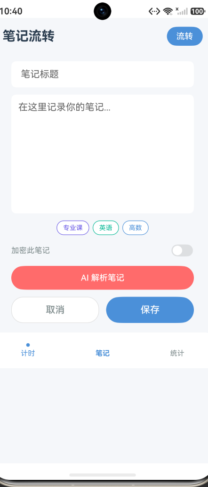
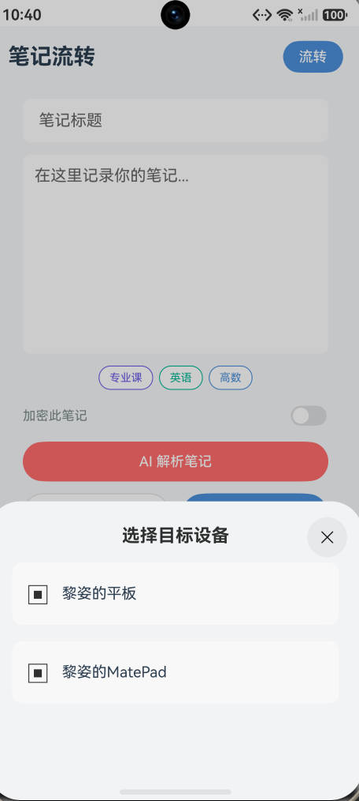
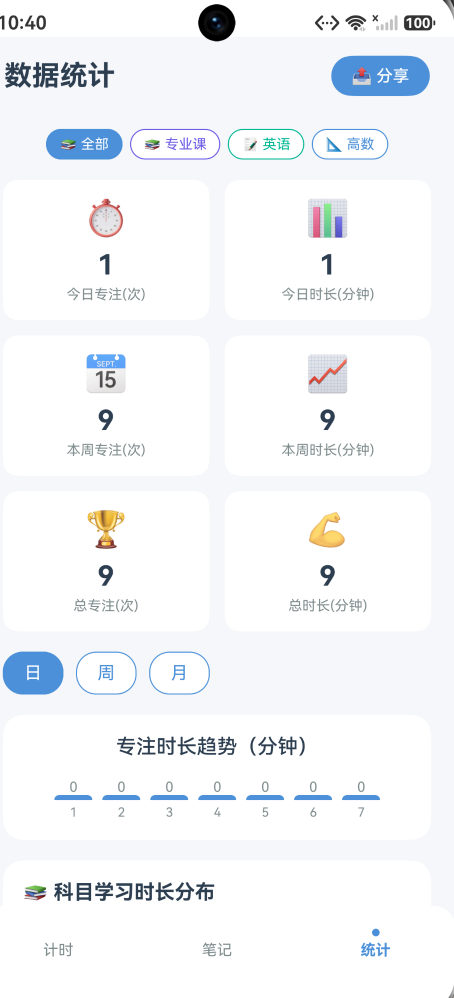
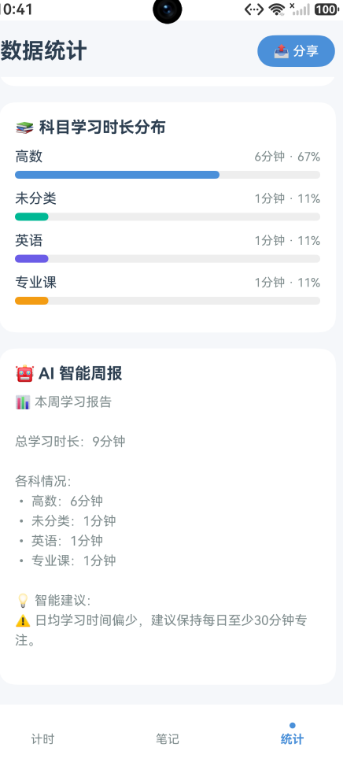
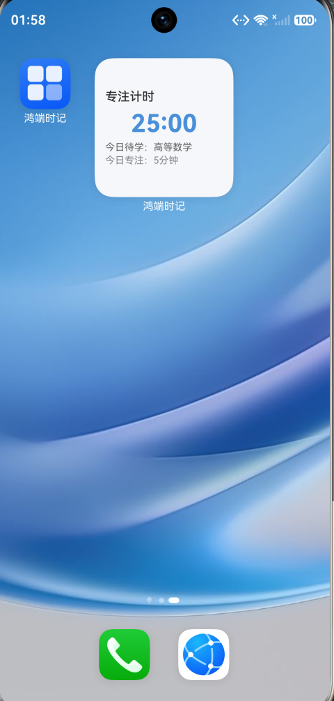

# 鸿蒙多端专注计时本（FocusTimer）

基于 HarmonyOS NEXT 的多端协同专注学习工具——专注计时、笔记流转、AI 智能周报、桌面元服务卡片与数据安全加密，帮你建立可持续的学习节奏。

## ✨ 亮点

- **多端流转**：手机 / 平板 / 穿戴设备间笔记与计时状态无缝接续，分布式数据实时同步，跨设备"选了就流转"
- **AI 智能周报**：基于真实学习记录自动生成个性化学习建议，数据驱动，不是通用鸡汤
- **桌面元服务卡片**：无需打开 App，桌面小组件实时掌握今日待学与专注进度
- **数据安全**：加密笔记 + 设备白名单 + 流转二次确认，隐私有底线

## 🚀 功能

- **专注计时**：5 / 15 / 25 / 45 / 60 分钟五档 + 自定义时长，计时结束弹窗提醒；专注免打扰模式，环境光线护眼提示
- **笔记流转**：多端笔记编辑、科目分类、一键流转到平板等设备，支持 AI 解析
- **数据统计**：日 / 周 / 月维度可视化报表，科目学习时长分布一目了然
- **AI 智能周报**：自动汇总本周学习情况，给出针对性改进建议
- **桌面卡片**：桌面小组件实时显示计时状态与今日目标
- **久坐提醒**：长时间久坐自动提醒，联动穿戴设备
- **数据安全**：加密文件夹、设备白名单、流转二次确认

## 📸 截图

| 专注计时 | 笔记流转 | 多端设备选择 |
| --- | --- | --- |
|  |  |  |

| 数据统计 | AI 智能周报 | 桌面卡片 |
| --- | --- | --- |
|  |  |  |

## 🛠️ 快速上手
> ⚠️ CI说明
> GitHub云端无法获取HarmonyOS NEXT API24 SDK，云端仅执行仓库规范性校验。
> **应用构建与全部52个单元测试，请在本地DevEco Studio环境执行。**
1. 使用 DevEco Studio 打开本项目
2. 配置应用签名（模拟器可直接运行）
3. 运行 HarmonyOS 模拟器即可体验

## 🏗️ 技术架构

- **UI 层**：ArkUI 声明式开发 + Stage 模型，页面模块化
- **业务层**：核心 Manager 模块——ContinuationManager（异常接续）、SubjectTagManager（科目标签）、FocusModeManager（免打扰）、SedentaryReminderManager（久坐提醒）、SecurityManager（加密）、DeviceWhitelistManager（白名单）、OfflineCacheManager（离线缓存）
- **数据层**：relationalStore 关系型数据库 + Preferences 首选项 + distributedDataObject 分布式对象 + FormKit 服务卡片
- **AI**：AIAnalysisService 学习数据分析与智能周报生成

## 📄 开源协议

Apache License 2.0，详见 [LICENSE](LICENSE)。
